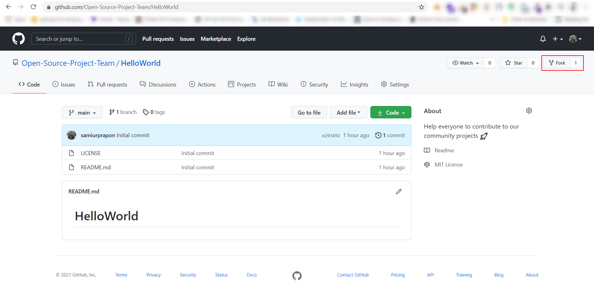

#### _Read this in <kbd>[](translations/README.bn.md)</kbd> বাংলা_

# Hello World

This project aims to simplify and guide our community to make their first contribution. We want each member of our community will have a contribution here.

# Getting Started

## 1. Fork this repository


## 2. Clone your reposotory
```bash
$ git clone https://github.com/<your-github-username>/HelloWorld.git
```

## 3. Create your feature branch:
```bash
$ git checkout -b <your-name>
```

## 4. Open `Contributors.md`
Write your name, github profile link in the end of the file and save it.
```
- [your-name](<your-github-profile-url>)
- <!--write here-->
```
 **Please don't delete this line**
 ```
 - <!--write here-->
 ```

## 5. Select file to commit
```bash
$ git add Contributors.md
```

## 6. Commit your changes:

```bash
$ git commit -m ":tada: introducing <your-github-username>"
```

## 7. Push to the branch:
```bash
$ git push origin <your-name>
```

## 8. Submit a pull request.


If you want to contribute to open source projects but couldn't understand all of this, It's okay. Just follow 👉 [First-Contribution](GUIDE.md) steps and start supporting open source community.


